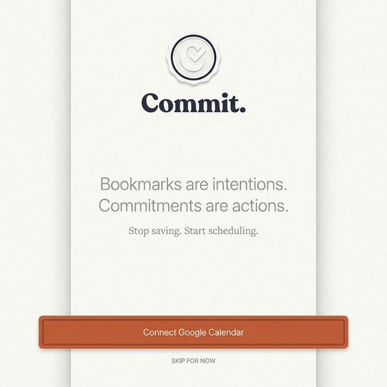
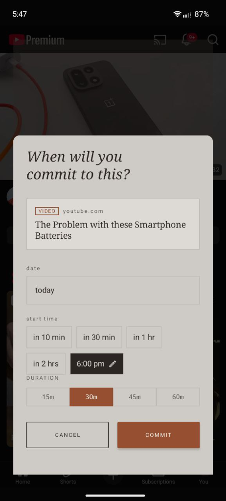

<div align="center">
  
  <h1>Commit - Android</h1>
</div>

> **Bookmarks are intentions. Commitments are actions.**

We save countless articles, videos, and threads, promising ourselves we'll get to them "later." But later rarely comes. The backlog grows, and so does the guilt.

**Commit** is different. It’s not a bookmark manager - it’s an action scheduler. When you share content to Commit, you don't just save it; you promise a time to engage with it.

---

<div align="center">
  
</div>

## Features

### 📅 Intentional Scheduling
Share any link from any app directly to Commit. Instead of a "Save" button, you get a "Commit" prompt. Choose **Tomorrow Morning**, **This Weekend**, or a specific time slot. It syncs instantly to your Google Calendar.

<div align="center">
  
</div>

### 🎨 Premium "Paper" Design
A visual departure from standard apps. Commit features a tactile **Paper** aesthetic with noise textures, diffused shadows, and editorial serif typography. It feels grounded, calm, and indistinguishable from a printed agenda.

### 🧠 Smart Insights
- **Dynamic Greetings**: The home screen welcomes you based on the time of day and your remaining load (e.g., *"Good afternoon. Finish your day strong."*).
- **Time Budgeting**: The app gently warns you if you're over-committing to too much content in a single day.
- **Reflection**: When you mark an item as done, Commit asks, *"Was this worth your time?"*, helping you build better content consumption habits.

### 🔥 Streaks & Progress
Track your consistency with a subtle **Streak Indicator**. Watch your daily commitments turn into a chain of completed actions.

---

## How It Works

1.  **Share**: Find an article or video in Chrome, YouTube, or Twitter. Tap "Share" and select **Commit**.
2.  **Commit**: A beautiful overlay slides up. Tap a smart chip like "Tomorrow Morning" or pick a custom time.
3.  **Action**: The event is added to your Google Calendar. When the time comes, you get a reminder.
4.  **Reflect**: After you read/watch, mark it done in the app and reflect on its value.

---

## Setup & Build

### Prerequisites
-   Android Studio Koala or newer
-   JDK 17
-   Google Cloud Console Project (for Calendar API)

### Google Cloud Setup
1.  Create a project in [Google Cloud Console](https://console.cloud.google.com/).
2.  Enable **Google Calendar API**.
3.  Create OAuth 2.0 Credentials (Android).
    -   Package name: `com.readlater` (Note: internal ID remains legacy for now).
    -   Add your SHA-1 fingerprint (debug/release).
4.  Add your email as a Test User in the OAuth Consent Screen.

### Build
```bash
git clone https://github.com/abhinahiii/commit.git
cd commit
./gradlew assembleDebug
```

---

## Tech Stack

-   **Language**: Kotlin
-   **UI**: Jetpack Compose (Material 3 heavily customized)
-   **Architecture**: MVVM
-   **Local Data**: Room Database
-   **Remote Sync**: Google Calendar API v3
-   **Auth**: Google Sign-In
-   **Parsing**: Jsoup (for link metadata)

---

## License

MIT. Go build something inevitable.
